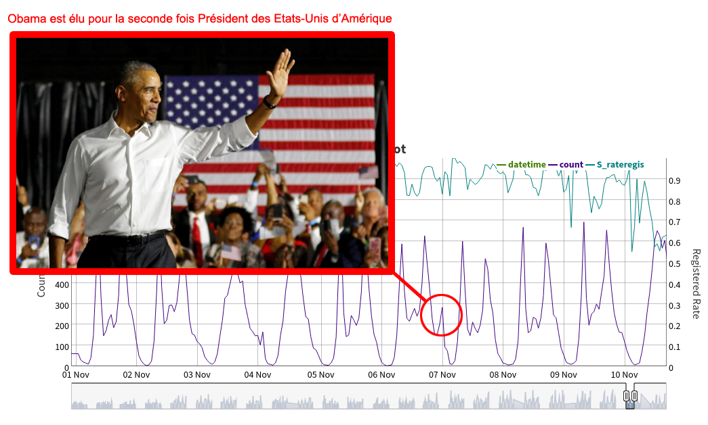
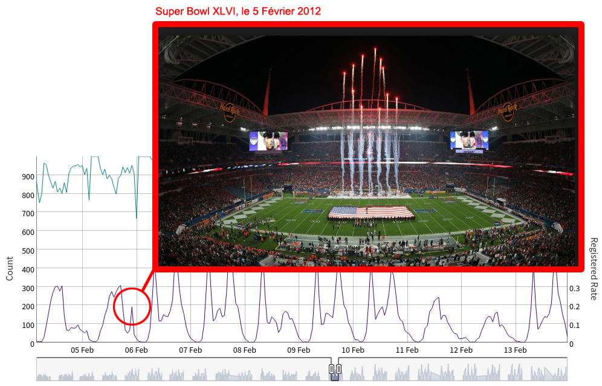

# Objectif

Les différentes étapes de notre participation au Kaggle Bike Sharing : https://www.kaggle.com/c/bike-sharing-demand/. Il s'agit de prédire le nombre de vélos loués dans la ville Washington, DC à différentes heures de la journée sur une période allant du 1er janvier 2011 au 31 Décembre 2012. Les variables à disposition permettant de modéliser la variable d'intérêt sont l'heure, le jour de la semaine, le mois de l'année, la température, etc. Cependant, la variable d'intérêt dépend également d'autres facteurs comme les événements majeurs de la vie sportive et politique américaine comme on peut le voir dans les exemples ci-dessous :

### Pic *anormal* de location de vélos lors de la seconde élection d'Obama le 6 Novembre 2012


### Pic *anormal* de location de vélos lors du Super Bowl XLVI le 5 Février 2012



# Environnement Conda
Afin de répliquer l'environnement utilisé, lancez l'action suivante 

```
conda env create -f environment.yml
```

# Auteurs

 * Serge Nakache : https://www.linkedin.com/in/serge-nakache-1b5364ab/
 * Vincent Gigliobianco : https://www.linkedin.com/in/vincent-gigliobianco-4b45a9a8/
 